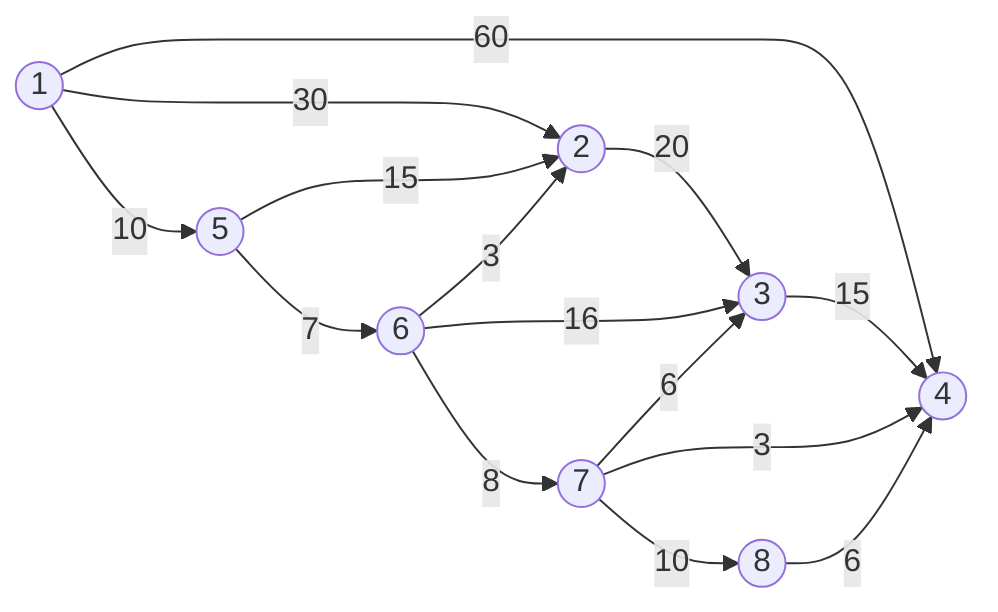

# CHEATSHEET YJJ

### 基本的概念

（1）<font color=green>数据元素</font>是数据的基本单位。

（2）<font color=green>数据项</font>是数据不可分割的最小单位。

（3）<font color=green>逻辑结构</font>和<font color=green>储存结构</font>的区别。前者是抽象出来的，数据之间的<font color=blue>逻辑关系</font>，比如线性结构（线性表，栈，队列，串）、树形结构、图状结构；后者是逻辑结构在计算机中的储存方式，主要包括<font color=blue>顺序存储、链式存储、散列存储</font>。

### 排序算法

#### 冒泡排序（Bubble Sort）

一遍又一遍从左到右扫过整个队列，比较相邻两个元素，将大的放在右边。第一次结束，最大的数被移到了最右边。

```python
def bubbleSort(arr):
    n=len(arr)
    for i in range(n):
        swapped=False
        for j in range(0,n-i-1):#最大的i个数已经在最右边排好了
            if arr[j]>arr[j+1]:
                arr[j],arr[j+1]=arr[j+1],arr[j]
                swapped=True
        if (swapped==False):
            break
```

#### 选择排序（Selection Sort）

在未排序序列中找到最小的元素，放到排序序列的起始位置。在从剩余未排序的元素中寻找最小元素，放在已排序序列的末尾。

```python
for i in range(len(s)):
    min_idx=i
    for j in range(i+1,len(s)):
        if s[min_idx]>s[j]:
            min_idx=j
    s[i],s[min_idx]=s[min_idx],s[i]#找到的最小数放在已排序的后面
```

#### 快速排序（Quick Sort）

选择一个元素作为枢轴（pivot），将比它小的数放在左边，大的放在右边。此时枢轴已经处于正确的位置上，再对左右两个序列重复操作。

```python
def quicksort(arr,left,right):#序列从left到right排序
    if left<right:
        partition_pos=partition(arr,left,right)
        quicksort(arr,left,partition_pos-1)
        quicksort(arr,partition_pos+1,right)
def partition(arr,left,right):
    i=left
    j=right-1
    pivot=arr[right]
    while i<=j:
        while i<=right and arr[i]<pivot:
            i+=1
        while j>=left and arr[j]>=pivot:
            j-=1
        if i<j:
            arr[i],arr[j]=arr[j],arr[i]
        if arr[i]>pivot:
            arr[i],arr[right]=arr[right],arr[i]
    return i
```

#### 插入排序（Insertion Sort）

把第一个元素看成有序队列（一个元素自身就是有序的），第二个至最后一个元素看成无序队列。每次将无序队列第一个元素插入有序队列。（一个一个比较，但不是换位置，而是比较完成后一次性插入）

#### 归并排序（Merge Sort）

把序列拆成两部分，对每一部分递归操作，然后拼贴在一起。注意，递归逻辑是，先把左边排好了，再排右边。

```python
def mergeSort(arr):
    if len(arr)>1:
        mid=len(arr)//2#分成两半
        L=arr[:mid]
        R=arr[mid:]
        mergeSort(L)
        mergeSort(R)
        i,j,k=0,0,0
        while i<len(L) and j < len(R):#将排好序的L，R合并到一起
            if L[i]<=R[j]:
                arr[k]=L[i]
                i+=1
            else:
                arr[k]=R[j]
                j+=1
            k+=1
        #以下两个循环实际上只会执行一个
        while i<len(L):#剩余元素放队尾，不能遗漏
            arr[k]=L[i]
            i+=1
            k+=1
        while j<len(R):
            arr[k]=R[j]
            j+=1
            k+=1
```

#### 希尔排序（Shell Sort）

按照gap作为间隔排序，再缩短间隔。可以看成是直接选择排序的升级版。

```python
def shellSort(arr,n):
    gap=n//2
    while gap>0:
        j=gap
        while j<n:
            i=j-gap
            while i>=0:
                if arr[i+gap]>arr[i]:
                    break
                else:
                    arr[i+gap],arr[i]=arr[i],arr[i+gap]
                i=i-gap
            j+=1
        gap=gap//2
```

各个排序方法的时间复杂度列在下面的表中。

| Name                     | Best      | Average   | Worst      | Memory   | Stable |
| ------------------------ | --------- | --------- | ---------- | -------- | ------ |
| In-place merge sort      | —         | —         | $n\log^2n$ | 1        | Yes    |
| 堆排序 Heap sort         | $n\log n$ | $n\log n$ | $n\log n$  | 1        | No     |
| 归并排序 Merge sort      | $n\log n$ | $n\log n$ | $n\log n$  | $n$      | Yes    |
| Tim sort（目前最快算法） | $n$       | $n\log n$ | $n\log n$  | $n$      | Yes    |
| 快速排序 Quick sort      | $n\log n$ | $n\log n$ | $n^2$      | $\log n$ | No     |
| 希尔排序 Shell sort      | $n\log n$ | $n^{4/3}$ | $n^{3/2}$  | 1        | No     |
| 插入排序 Insertion sort  | $n$       | $n^2$     | $n^2$      | 1        | Yes    |
| 冒泡排序 Bubble sort     | $n$       | $n^2$     | $n^2$      | 1        | Yes    |
| 选择排序 Selection sort  | $n^2$     | $n^2$     | $n^2$      | 1        | No     |

### 列表

#### 1.散列表

通过设计映射函数，根据给定的值计算出应当储存的位置。这样的函数也叫做**散列函数**或者**哈希函数**，相应的查找表叫做**哈希表**。因为可以通过key值直接计算出储存的位置，所以散列表的查找的时间复杂度基本上<font color=green>与数据规模n无关，为O(1)</font>。

向后顺延直至该位置未被占用，称为<font color=red>线性探测法</font>，只要表没满就可以找到一个位置。

<font color=green>二次探测法</font>，是按照$i^2$步伐来移动，即$d_i=i^2$，以规避冲突。

或者可以用单链表记录计算出来的地址相同的元素。也叫做<font color=green>开散列法</font>，示意图如下：


#### 2.栈和队列

**线性表**描述了元素按线性顺序排列的规则。常见的线性表有**数组**和**链表**。（树不是线性结构）

**数组/顺序表**的储存是<font color=red>连续的</font>，元素按照顺序存储在内存中连续地址空间上。**访问**元素时间复杂度为O(1)，**插入和删除**为O(n)，因为要移动其他元素来保持连续存储的特性。

<font color=blue>访问是知道位置，知道元素大小去找在哪里叫做查找，数组和链表查找的时间复杂度都是O(n)</font>

**链表**的每个节点包含<font color=red>元素本身以及指向下一个节点的指针</font>，**插入和删除**为O(1)，因为只需要调整指针。**访问**为O(n)，因为必须从头开始遍历链表。链表分为：

（1）**单向链表（单链表）**：每个节点只有一个指向下一个节点的指针，最后一个节点指针为空（指向None）

（2）**双向链表**：每个节点有两个指针，一个指向前一个节点，一个指向后一个节点。

（3）**循环链表**：最后一个节点的指针指向链表的头部。

注意，在python中，list是使用==动态数组==（Dynamic Array）实现的。动态数组是一种连续的、固定大小的内存块，可以在需要时自动调整大小。list支持快速随机访问和高效的尾部操作如append和pop

队列和栈是两种重要的数据结构，它们具有push k和pop操作。push k是将数字k加⼊到队列或栈中，pop则是从队列和栈取⼀个数出来。队列和栈的区别在于取数的位置是不同的。
**队列**（queue）是**先进先出**的：把队列看成横向的⼀个通道，则push k是将k放到队列的最右边，而pop则是从队列的最左边取出⼀个数。

一种特殊的队列是**循环队列**，其特点在于最后一个元素的位置指向第一个元素，从而在逻辑上形成了环状结构。<font color=green>front</font>指向队头而<font color=green>rear</font>指向队尾。循环队列事先约定好了最大容量<font color=green>m</font>，有以下关系式成立：

（1）若$front=rear$则队列为空；

（2）若$(rear+1)\% m=front$则队列已满；

（3）队列长度$(rear-front+m)\%m$;

（4）一个新元素入队，$rear=(rear+1)\% m$；

（5）一个元素出队，$front=(front+1)\%m$

**栈**(stack)是**后进先出**的：把栈也看成横向的⼀个通道，则push k是将k放到栈的最右边<font color=green>栈顶</font>，而pop也是从栈的最右边取出⼀个数。栈的左边称为<font color=green>栈底</font>。

#### 3. KMP算法

（1）求出next列表

计算每个字串的最大相等前后缀长度，例如对于aabaaf，next=[0,1,0,1,2,0]

```python
def countNext(b):
    i,k,L=1,0,len(b)
    next=[0]*L #next[0],next[1]都已知为0,next[i]保存的是b[:i]的最大相等前后缀
    while i<L-1:
        if b[i]==b[k]:
            next[i+1]=k+1
            i,k=i+1,next[i+1]
        else:
            if k==0:
                next[i+1]=0
                i,k=i+1,next[i+1]
            else:
                k=next[k]#递归地比较
    return next
```


（2）在t[j]比较失败时，i不变，j退回到next[j-1]，继续匹配。

### 树

#### 1. 二叉搜索树（二叉排序树）

左子树中的每个节点的值都小于根节点；右子树中每个节点的值都大于根节点。

#### 2.二叉堆

**完全二叉树**：每一层从左到右依此填充，全部填充满后才开始填充下一层。

我们可以利用完全二叉树来实现**堆**，或者说是**二叉堆**，每一层都是从左到右填充。有趣的是，完全二叉树可以用列表来表示，因为对于每一个节点其位置为p（注意这里的位置不是从0开始，而是从1开始），左子节点$2p$，右子节点$2p+1$，其次堆具有**有序性**，即子节点x必定不小于父节点p。**小根堆/大根堆**：父节点的值小于/大于其子节点的值。

**哈夫曼编码**：每次从森林中选取根节点权值最小的两棵树，将其合并为一棵树加回到森林中。这棵树的根节点权值为两棵树根节点权值之和，左右节点分别为两棵树的根节点，并且左节点小于右节点。

#### 3. 树、森林、二叉树的相互转化

将一棵普通**树**转化成二叉树的过程可以记住这个简洁的口诀：**左儿子，右兄弟**。下面是具体的步骤：

（1）将树的根节点直接作为二叉树的根节点。

（2）将树的根节点的**第一个子节点**作为根节点的左儿子。如果该子节点存在兄弟节点，将该子节点的第一个兄弟节点（方向从左往右）作为该子节点的右兄弟。

（3）依序将树中的剩余节点按照上一步的方式添加到二叉树中，直到树中所有的节点都在二叉树中。

将**森林**转化为二叉树，将森林中的所有树视为兄弟，第一棵二叉树不变，第二棵二叉树的根节点添加到第一棵树根节点的右子节点。如何判断一棵二叉树是森林还是树？若根节点右子节点非空则为森林，反之为树。

### 图

**连通图**：无向图中，任意两个顶点都是连通的。

**强连通图**：在有向图中，对任意顶点$V_i,V_j$，从$V_i$到$V_j$和从$V_j$到$V_i$都连通。

**连通分量**：一个连通无向图的连通分量就是自己本身，同时也是最大连通图。

#### 1.邻接矩阵

想法很简单，没两个点之间的关系用二维矩阵的一个元素表示。具体而言，$$a_{vw}$$是从顶点$v$到顶点$w$的==有向边==的权重。我们立刻可以知道，邻接矩阵的对角元都是0；且对于无向图，其对应的邻接矩阵应当是对称矩阵。

#### 2.邻接表（注意题目可能会有逆邻接表）

利用列表和字典来实现记录图。建立一个包含所有顶点的列表，对每个顶点建立一个字典，其中的键是到达的顶点，值是对应的边的权重。很显然，这里是针对有向图而言的。

#### 3. 生成树

- 一个连通图可以有多个生成树；
- 一个连通图的所有生成树都包含相同的顶点个数和边数；
- 生成树当中不存在环；
- **移除生成树中的任意一条边都会导致图的不连通**， 生成树的边最少特性；
- 在生成树中**添加一条边会构成环**。
- 对于包含n个顶点的连通图，生成树包含n个顶点和n-1条边；
- 对于包含n个顶点的无向完全图最多包含 $n^{n-2}$ 颗生成树。

对于带权图而言，最小生成树是边的权值之和最小的生成树。实现最小生成树的算法主要有两种。

#####  **Kruskal 算法**

1.将图中的所有边按照权重从⼩到⼤进⾏排序。

2.初始化⼀个空的边集，用于存储最小生成树的边。

3.重复以下步骤，直到边集中的边数等于顶点数减⼀或者所有边都已经考虑完毕：
	3.1选择排序后的边集中权重最⼩的边。
	3.2如果选择的边不会导致形成环路（即加⼊该边后，两个顶点不在同⼀个连通分量中），则将该边加⼊最⼩⽣成树的边集中。

4.返回最小生成树的边集作为结果。

一般来说，在实现代码的过程中会用到==并查集==

##### **Prim 算法**

基本想法：贪心。构建两个集合，一个是目前可到达的点集A，一个是目前不可到达的点集B。每次从B中挑选最短的可以连接到A的路径添加。

##### Dijkstra算法

这个算法用于解决单源最短路径问题。对于给定的源节点，找到它到其余所有节点的最短路径。缺点在于，<font color=green>不能处理包含负值路径的体系</font>。具体操作流程如下：

（1）初始化一个距离数组，用于记录源节点到其他所有节点的**最短**距离。初始时，源节点到自身距离为0，到其余点为无穷大；

（2）选择一个未访问的节点中，距离最小的节点作为**当前节点**；

<font color=green>第一次这个节点就是源节点，所有直接与它相邻的顶点的距离都会由无穷大更新为与源节点直接相邻路径的长度</font>

（3）对于当前节点的所有邻居节点，若通过当前节点到达邻居节点的路径比已知最短路径更短，则更新最短路径；

（4）标记当前节点为已访问，重复以上步骤直到所有节点都被访问或者所有节点的最短路径都被确定。

##### 判断无向图中是否有环

（1）将所有度<=1的节点加入队列；

（2）队列不为空时，弹出节点，并移去其所有的边（相邻节点度-1），如出现度<=1的节点则加入队列；

（3）若所有节点都进入过队列，则无环。

##### 判断有向图中是否有环（Kahn算法）

此算法的时间复杂度为O(V+E)，具体思路是：

（1）将所有入度为0的节点加入队列；

（2）队列不为空时，弹出节点，并移去所有从其出发的边（该节点指向的所有点入度-1），如出现入度为0的节点则加入队列；

（3）若所有节点都进入过队列，则无环。

### 题

（1）单链表的存储密度（ C ）。
A．大于1    B．等于1   C．小于1  D．不能确定

（2）将两个各有n个元素的有序表归并成一个有序表，其最少的比较次数是（ A ）。
A. n       B．2n-1     C．2n     D．n-1

（3）在一个长度为n的顺序表中，在第i个元素（1≤i≤n+1）之前插入一个新元素时须向后移动（ B ）个元素。
A．n-i      B．n-i+1    C．n-i-1    D．i

（4）若指定有n个元素的向量，则建立一个有序单链表的时间复杂性的量级是（ C ）。
A．O(1)      B．O(n)       C．O(n^2)      D．$O(nlog_2n)$

建立一个有序单链表的时间复杂度是$O(n^2)$。这是因为在单链表中插入元素需要遍历链表找到正确的位置，而每次插入的时间复杂度是O(n)，如果需要插入n个元素，那么总的时间复杂度就是O(n^2)。

（5）设有一个递归算法如下

```python
def fact(n):  #n大于等于0
    if n <= 0:
        return 1
    else:
        return n * fact(n - 1)
```

则计算fact(n)需要调用该函数的次数为（ A ）。 

A． n+1       B． n-1        C． n         D． n+2

（6）串是一种特殊的线性表，其特殊性体现在（ B ）。

 A．可以顺序存储        B．数据元素是一个字符   

C．可以链式存储        D．数据元素可以是多个字符

（7）串既可以采用顺序存储，也可以采用链式存储。

（8）串的**长度**是指串中所含字符的个数。

（9）若对n阶对称矩阵A以行序为主序方式将其下三角形的元素(包括主对角线上所有元素)依次存放于一维数组B[1..(n(n+1))/2]中，则在B中确定aij（i<j）的位置k的关系为（ j * (j-1)/2+i ）。

（10）A[N，N]是对称矩阵，将下面三角（包括对角线）以行序存储到一维数组T[N(N+1)/2]中，则对任一上三角元素a\[i][j]对应T[k]的下标k是（ j(j-1)/2+i  ）

（11）若二叉树采用二叉链表存储结构，要交换其所有分支结点左、右子树的位置，利用（ C ）遍历方法最合适。A．前序     B．中序       C．后序   D．按层次

A、C、D应该都对。C是类似于递归自底向上，D是自顶向下。这种题目与实现有关，出成选择题不合适。

（12）采用线性探测法处理冲突，可能要探测多个位置，在查找成功的情况下，所探测的这些位置上的关键字 (  A)。

A．不一定都是同义词        B．一定都是同义词    C．一定都不是同义词         D．都相同

（13）试用 Dijkstra 算法求出下图中顶点 1 到其余各顶点的最短路径，写出算法执行过程中各步的状态，填入下表。





<p align="right">顶点1到其他顶点的最短路径长度</p>

| 所选顶点 | U(已确定最短路径的顶点集合) | T(未确定最短路径的顶点集合) | 2    | 3    | 4    | 5    | 6    | 7    | 8    |
| -------- | --------------------------- | --------------------------- | ---- | ---- | ---- | ---- | ---- | ---- | ---- |
| 初态     | {1}                         | {2, 3, 4, 5, 6, 7, 8}       | 30   | ∞    | 60   | 10   | ∞    | ∞    | ∞    |
| 1        | {1, 5}                      | {2, 3, 4, 6, 7, 8}          | 25   | ∞    | 60   | 10   | 17   | ∞    | ∞    |
| 5        | {1, 5, 6}                   | {2, 3, 4, 7, 8}             | 20   | 33   | 60   | 10   | 17   | 25   | ∞    |
| 6        | {1, 5, 6, 2}                | {3, 4, 7, 8}                | 20   | 33   | 60   | 10   | 17   | 25   | ∞    |
| 2        | {1, 5, 6, 2, 7}             | {3, 4, 8}                   | 20   | 31   | 28   | 10   | 17   | 25   | 35   |
| 第5步    | {1, 5, 6, 7, 2, 4}          | {3, 8}                      | 20   | 31   | 28   | 10   | 17   | 25   | 35   |
| 4        | {1, 5, 6, 7, 2, 4, 3}       | {8}                         | 20   | 31   | 28   | 10   | 17   | 25   | 35   |
| 3        | {1, 5, 6, 7, 2, 4, 3, 8}    | {}                          | 20   | 31   | 28   | 10   | 17   | 25   | 35   |


```python
class Node:
    def __init__(self, data, next = None):
        self.data, self.next = data, next

class LinkedList:
    def __init__(self, lst):
        self.head = Node(lst[0])
        p = self.head
        for i in lst[1:]:
            p.next = Node(i)    # 等号右侧填空（1分）
            p = p.next  				# 等号右侧填空（2分）
def reverse(self): # 把head当pre用，天才 said by 胡睿诚
    p = self.head.next
    self.head.next = None   # 等号右侧填空（2分）
    while p is not None:
        q = p
        p = p.next  				# 等号右侧填空（1分）
        q.next = self.head  # 等号右侧填空（2分）
        self.head = q    		# 留空行，此行代码需要填写（2分）

def reverse_3p(self): # 常规思维：三个指针来反转链表的指针指向关系
    prev = None
    current = self.head
    while current:
        next_node = current.next
        current.next = prev
        prev = current
        current = next_node
    self.head = prev

def print_list(self):
    p = self.head
    while p:
        print(p.data, end=" ")
        p = p.next
    print()
```